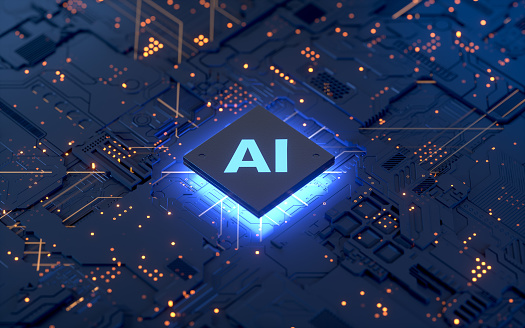

A guide on basics and how to approach Artificial Intelligence.

The repo contains the coding tutorials for the topics covered throughout the book.

The Complete resource including the book and additional resources like code and documents links have been prepared with combined efforts of following authors:

Note- All the codes have been run on google colab for ease purposes. 

 It eliminates the need to natively maintain various environments and packages to run the code. They also provide GPU for accelerated learning.

 If someone faces problem in implementing this code on their local environment, please create a pull request for the same. It will be resolved asap.
